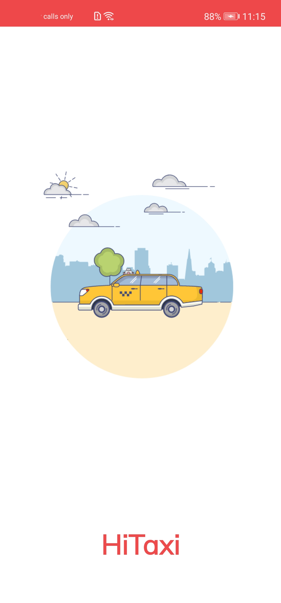
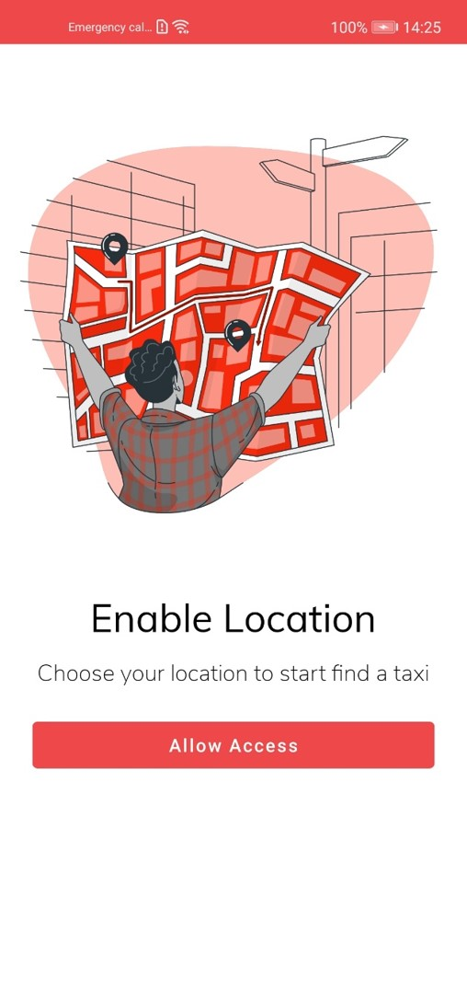
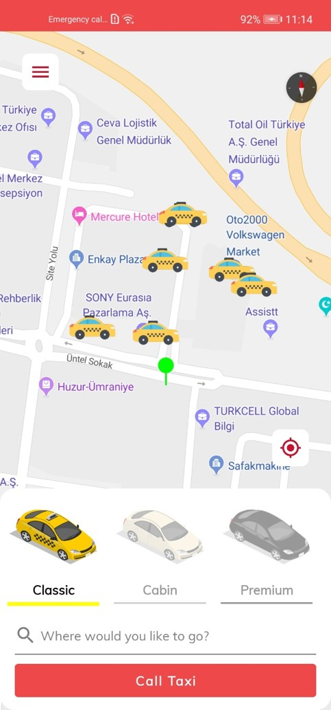
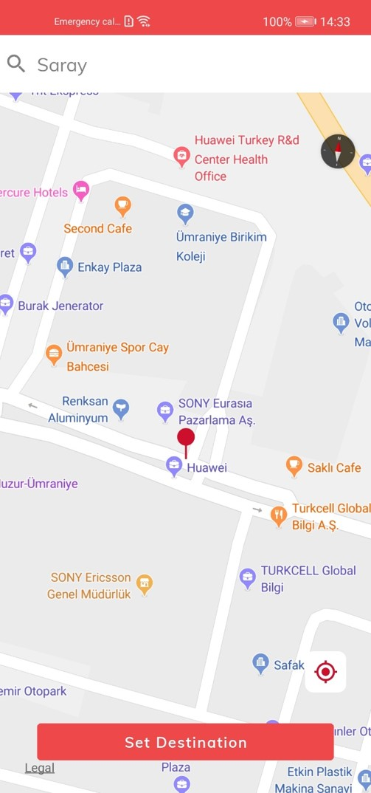
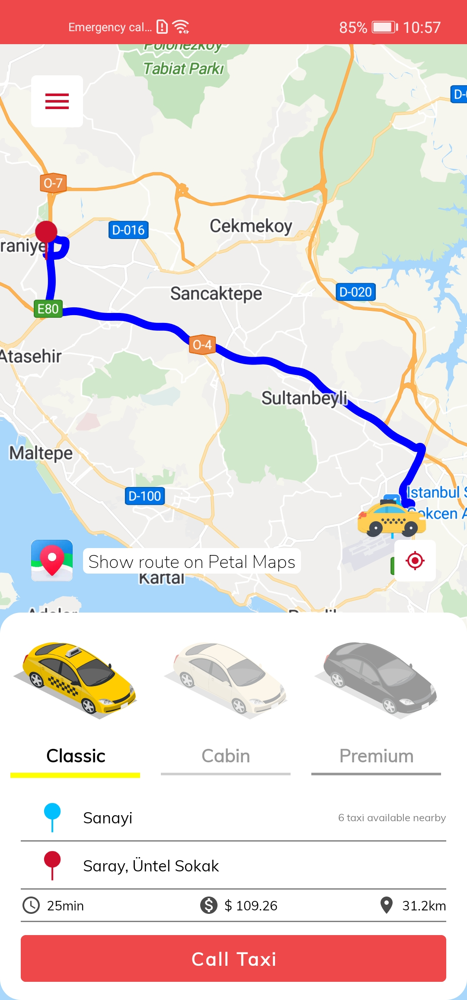
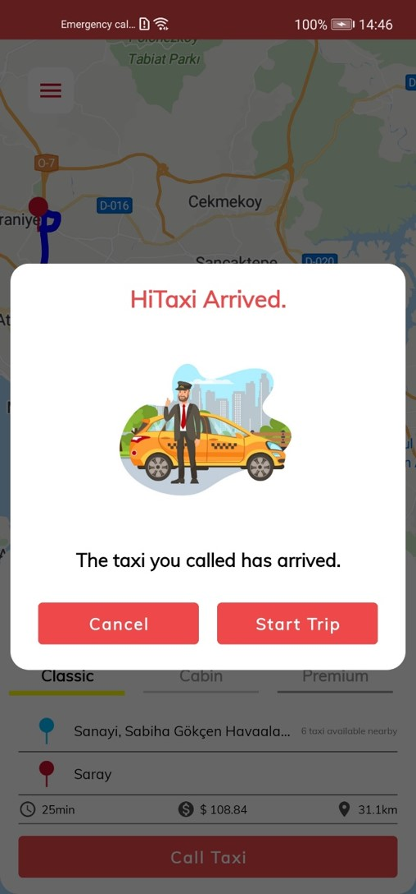
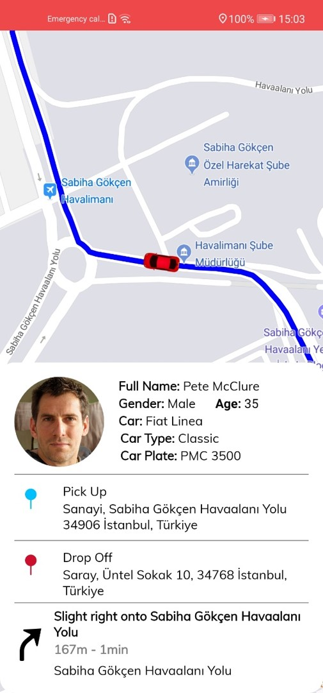
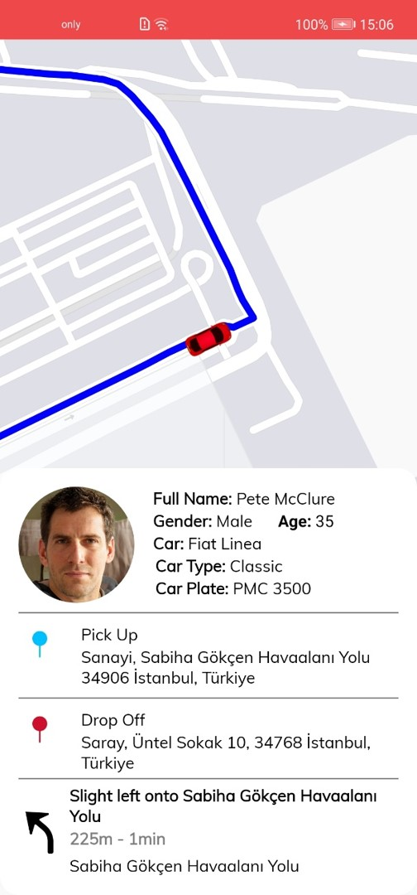

# Hi Taxi Java Codelab

    

Request a taxi with one tap and watch as it comes to you!

Hi Taxi finds the nearest taxi around and directs it to you. You can see driver's name, photo, ratings and license plate as well as the ETA on a live map.

## Introduction

Easily request a ride with the Hi Taxi reference app:
1.	Open the app and set your destination;
2.	Request a driver to pick you up;
3.	Wait for your driver and get informed when driver comes to your location;
4.	See the route on Petal Maps or real time inside the application;
5.	Enjoy the ride to your destination.

## About HUAWEI Analytics Kit

HUAWEI Analytics Kit provides free data analysis for a wide range of devices and platforms, so you can make informed decisions on product optimization and marketing based on your users' behavior.

For more information -> [Huawei Analytics Kit Guide](https://developer.huawei.com/consumer/en/doc/development/HMSCore-Guides/introduction-0000001050745149)

## About HUAWEI Crash Kit

The AppGallery Connect Crash service provides a powerful yet lightweight solution to app crash problems.

For more information -> [Huawei Crash Kit Guide](https://developer.huawei.com/consumer/en/doc/development/AppGallery-connect-Guides/agc-crash-introduction-0000001055732708)

## About HUAWEI Location Kit

Location Kit combines the Global Navigation Satellite System (GNSS), Wi-Fi, and base station location functionality into your app to build up global positioning capabilities, allowing you to provide flexible location-based services for global users

For more information -> [Huawei Location Kit Guide](https://developer.huawei.com/consumer/en/doc/development/HMSCore-Guides/introduction-0000001050706106)

## About HUAWEI Map Kit

Map Kit provides powerful and convenient map services for you to implement personalized map display and interaction at ease.

For more information -> [Huawei Map Kit Guide](https://developer.huawei.com/consumer/en/doc/development/HMSCore-Guides/android-sdk-introduction-0000001061991291)

## About HUAWEI Site Kit

Bolstered with a myriad of POIs, Site Kit offers you many search capabilities such as place search, time zone search, geocoding, and administrative region search, helping your app attract more users.

For more information -> [Huawei Site Kit Guide](https://developer.huawei.com/consumer/en/doc/development/HMSCore-Guides/android-sdk-about-the-service-0000001076188604)

## What You Will Need

**Hardware Requirements**
- A computer that can run Android Studio.
- Huawei mobile device with a USB data cable for running developed apps

**Software Requirements**
- Java JDK 1.8 or later
- Android Studio 4.X
- Android SDK package
- Android API Level 19 or higher
- HMS Core (APK) 4.0.2.300 or later
- EMUI 8.1 or later

## Getting Started

Hi Taxi uses HUAWEI services. In order to use them, you have to [create an app](https://developer.huawei.com/consumer/en/doc/distribution/app/agc-create_app) first. Before getting started, please [sign-up](https://id1.cloud.huawei.com/CAS/portal/userRegister/regbyemail.html?service=https%3A%2F%2Foauth-login1.cloud.huawei.com%2Foauth2%2Fv2%2Flogin%3Faccess_type%3Doffline%26client_id%3D6099200%26display%3Dpage%26flowID%3D6d751ab7-28c0-403c-a7a8-6fc07681a45d%26h%3D1603370512.3540%26lang%3Den-us%26redirect_uri%3Dhttps%253A%252F%252Fdeveloper.huawei.com%252Fconsumer%252Fen%252Flogin%252Fhtml%252FhandleLogin.html%26response_type%3Dcode%26scope%3Dopenid%2Bhttps%253A%252F%252Fwww.huawei.com%252Fauth%252Faccount%252Fcountry%2Bhttps%253A%252F%252Fwww.huawei.com%252Fauth%252Faccount%252Fbase.profile%26v%3D9f7b3af3ae56ae58c5cb23a5c1ff5af7d91720cea9a897be58cff23593e8c1ed&loginUrl=https%3A%2F%2Fid1.cloud.huawei.com%3A443%2FCAS%2Fportal%2FloginAuth.html&clientID=6099200&lang=en-us&display=page&loginChannel=89000060&reqClientType=89) for a HUAWEI developer account.

After creating the application, you need to [generate a signing certificate fingerprint](https://developer.huawei.com/consumer/en/codelab/HMSPreparation/index.html#3). Then you have to set this fingerprint to the application you created in AppGallery Connect.
- Go to "My Projects" in AppGallery Connect.
- Find your project from the project list and click the app on the project card.
- On the Project Setting page, set SHA-256 certificate fingerprint to the SHA-256 fingerprint you've generated.

## Using the Application

Upon completing the essential parts of the code, connect your mobile device to the PC and enable the USB debugging mode. In the Android Studio window, click icon to run the project you have created in Android Studio to generate an APK. Then install the APK on the mobile device.

1.	Open the app upon installing it to your device.
2.	In this home screen, firstly check that user has allowed for location permissions or has not.
If user has not allowed the application for location permission, screen which is on right side will be showed user to allow user for location permissions.
3.	If user has allowed location permission, map will be showing user’s location.
On bottom sheet, users can choose the car type and destination place.
After destination and departure point has been selected, users can call the taxi.
4.	Users have two options to choose the location.
First one is choosing location on map. As you see on the screen which is on left side, if users click on set destination button, location will be selected which red marker is showing on map.
Second one is choosing location with the help of Site Kit’s Widget feature. Users can type a location and choose one location from recommended places.
5.	Show route on Petal Maps
6.	After taxi has arrived and user has clicked on start trip button, trip will start.
On bottom sheet, driver’s data will be shown, pick up and drop off places will be shown and next step will be described.

## Screenshots

## Project Structure

Hi Taxi is designed with MVVM design pattern and Java language.

## Libraries
- Huawei Analytics Kit
- Huawei Crash Kit
- Huawei Location Kit
- Huawei Map Kit
- Huawei Site Kit
- Dagger Hilt
- Navigation
- RxJava3
- ViewBinding
- ViewModel
- Glide
- Retrofit
- CircleImageView
- Country Code Picker
- Droidsonroids Gif Image View
- Lottie

## Contributors

- Abdurrahim Cillioglu
- Ahmet Yunus Sevim
- Berk Ozyurt
- Ertug Sagman
- Mehmet Yozgatli
- Mustafa Saritemur