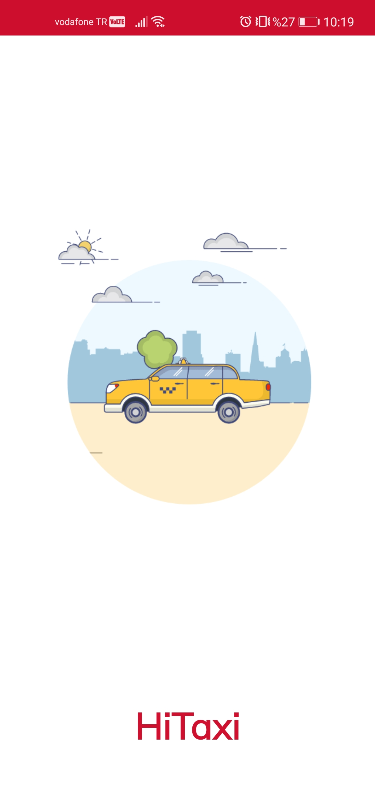
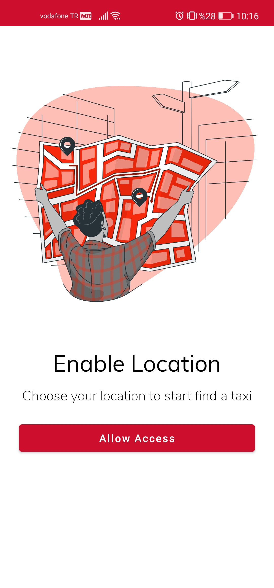
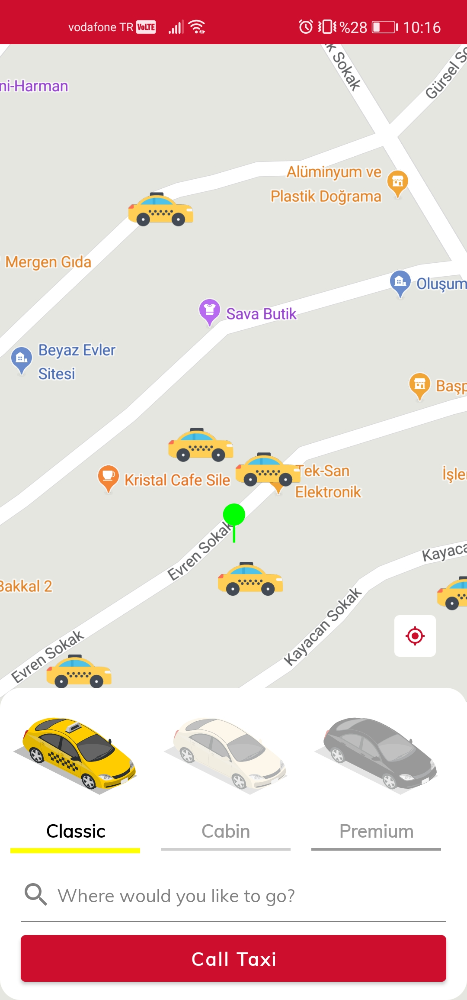
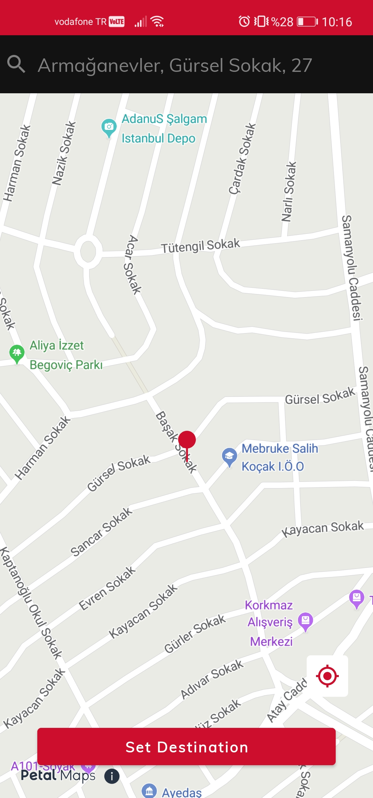
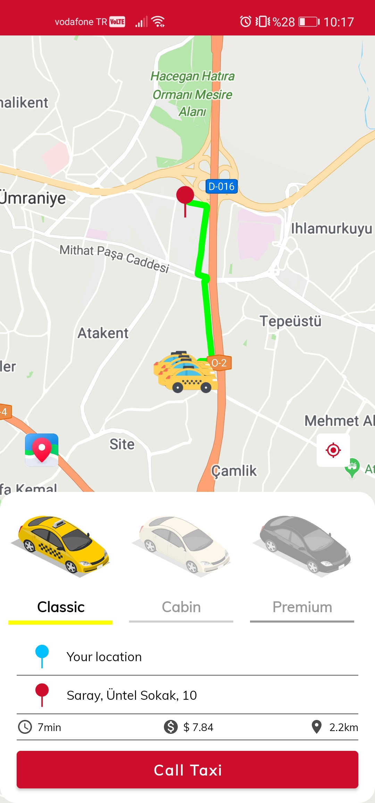
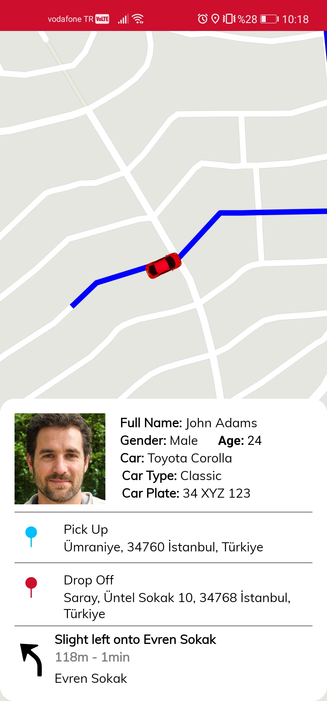
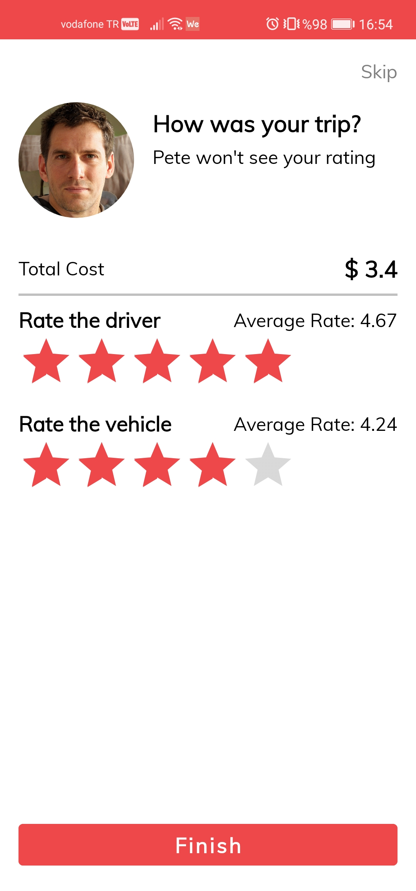

# HiTaxi - Map Kit Directin API Codelab

## Table of Contents

 * [Introduction](#introduction)
 * [Installation](#installation)
 * [Configuration ](#configuration )
 * [Supported Environments](#supported-environments)
 * [Sample Code](#sample-code)
 * [Screenshots](#screenshots)
 * [License](#license)

## Introduction
	The application in the codelab-HiTaxi finds the nearest taxi around and directs it to you.
	You can see the driver's name, photo, ratings, and license plate as well as the ETA on a live map.
    This codelab encapsulates APIs of the HUAWEI Site Kit, HUAWEI Map Kit, HUAWEI Location Kit, and Huawei Map Kit - Directions API.
    It is a codelab that will be an example of how these kits work both individually and together.
	During a trip/journey, ETA is used to convey to the passengers how much time is left before the transport gets to a certain point.
	This codelab is a good example for route creation by choosing a location on the map and ETA.
    Before you use this codelab, it's assumed that you already have a HUAWEI developer account and have already
    created an app to implement the HMS capabilities.

    If you haven't,    please refer to https://developer.huawei.com/consumer/en/doc/start/introduction-0000001053446472
    and https://developer.huawei.com/consumer/en/doc/development/AppGallery-connect-Guides/agc-introduction.

## Installation
    Before using the code, check whether the Android Studio environment has been installed.
    Download the project as a zip file or clone in Github.
    Wait for the gradle build in your project.

## Supported Environments
	•	Android Studio 4.X or later version
	•	Java JDK 1.8 or later version
	•	Android API Level 21 or higher
	•	EMUI 8.1 or later version
	•	HMS Core (APK) 5.0.0.300 or later version

## Configuration
    1. Register and sign in to HUAWEI Developers.
    2. Create a project and then create an app in the project, enter the project package name.
    3. Go to Project Settings > Manage APIs, find the Map Kit, Site Kit and Location Kit, and enable it.
    4. Go to Project Settings > General information, click Set next to Data storage location under Project information,
    and select a data storage location in the displayed dialog box.
    5. Download the agconnect-services.json file and place it to the app's root directory of the project.
    6. Add the Maven repository address maven {url 'https://developer.huawei.com/repo/'} and plug-in class path
    'com.huawei.agconnect:agcp:1.4.2.300' to the project-level build.gradle file.
    7. Add apply plugin: 'com.huawei.agconnect' to the last line of the app-level build.gradle file.
    8. Configure the dependency 'com.huawei.hms:location:5.0.0.301' , 'com.huawei.hms:maps:5.0.3.302', and
    'com.huawei.hms:site:5.1.0.300' in the app-level buildle.gradle file.
    9. Synchronize the project.

## Sample Code
    The LocationService class is used to obtain location permissions and the last known location data.
	The address information of LatLng is obtained by GeocodeHelper class.
	LocationUtil class checks the GPS status and sets the FusedLocation to use in other fragments of the application.
	The route between two points is calculated with the getRoute() method in HomeFragment, and the route calculated with addRouteOnScreen() is displayed on the map.
	The HomeviewModel class performs the route and location process and includes all location and route information. With the clearViewModel() method, the HomeViewModel class is reset.
	In the DestinationFragment class, the destination point is selected with the Site Kit and Location Kit.

    1) Developing Location Search with Site Kit
    You can search locations and attraction points on the map using Site Kit.
    Code location: src/main/java/ com.huawei.hitaxicodelab/ui/destination/DestinationFragment.kt

    2) Developing Map with Markers and Camera Controls using Map Kit
    You can use Map Kit view on your layout, add markers on it and control the camera of the map.
    Code location: src/main/java/ com.huawei.hitaxicodelab/ui/home/HomeFragment.kt
	Layout location: src/main/res/layout/fragment_home.xml

    3) Using Location Kit to Get Device Location
    You can retrieve user location with Location Kit. You have to control device permissions of sharing location with the app.
    Retrieve location code: src/main/java/ com.huawei.hitaxicodelab/ui/home/HomeFragment.kt
	Request&check user permission: src/main/java/ com.huawei.hitaxicodelab/ui/permission/PermissionFragment.kt

## Screenshots
  
  
 

##  License
    HiTaxi is licensed under the [Apache License, version 2.0](http://www.apache.org/licenses/LICENSE-2.0).
